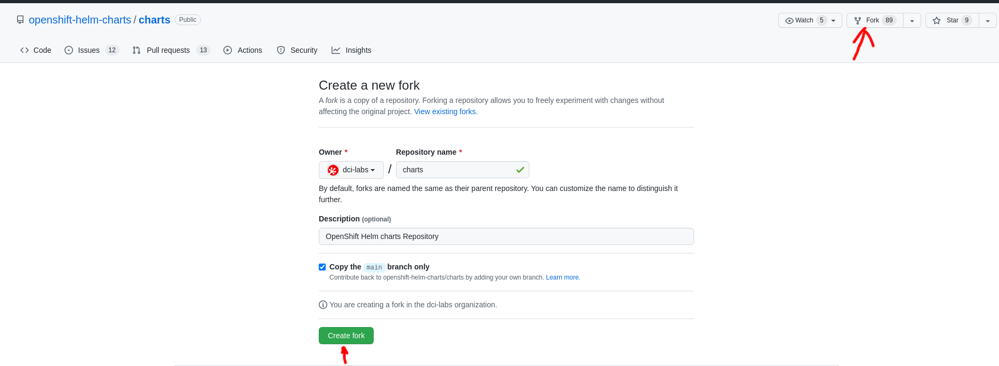
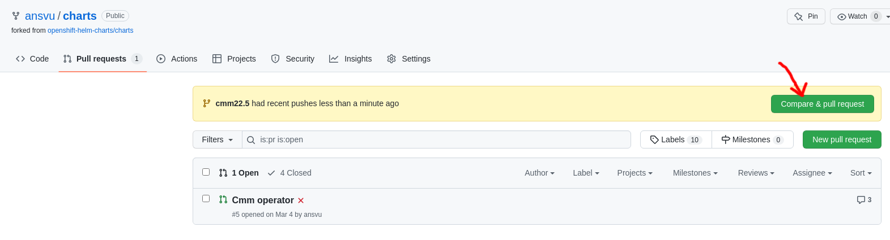
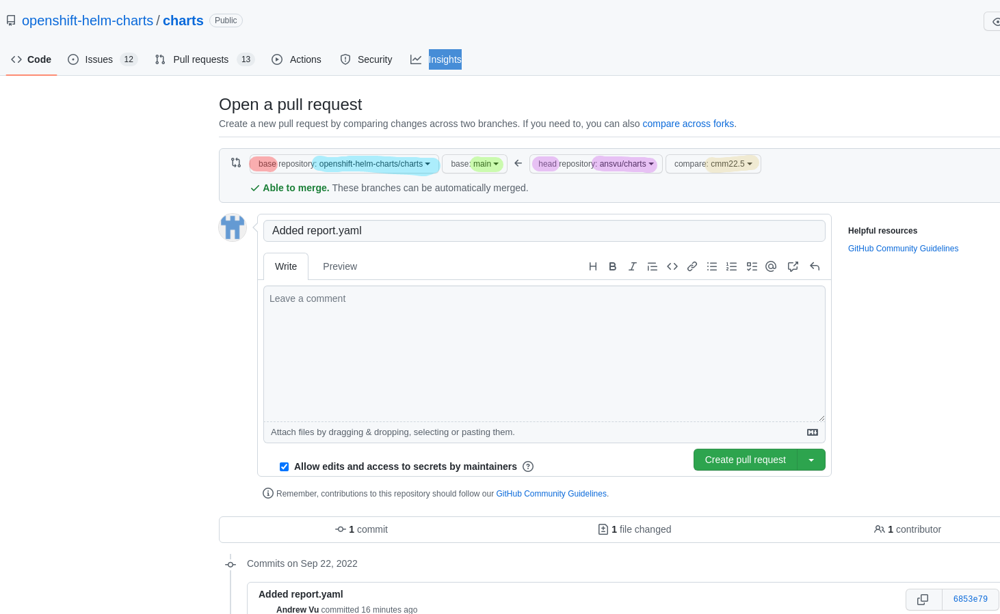

Table of Contents
=================

* [How To PR For Partner Helmchart Certification](#how-to-pr-for-partner-helmchart-certification)
   * [Pre-requisite](#pre-requisite)
   * [Fork openshift-helm-charts/charts](#fork-openshift-helm-chartscharts)
   * [Clone Main Charts Repo](#clone-main-charts-repo)
   * [Add Upstream to Main Charts Repository](#add-upstream-to-main-charts-repository)
   * [Add Origin to your own helm-chart that fork from main](#add-origin-to-your-own-helm-chart-that-fork-from-main)
   * [Check Git Remote status for origin and upstream](#check-git-remote-status-for-origin-and-upstream)
   * [Checkout charts Repository as new branch](#checkout-charts-repository-as-new-branch)
   * [Check Git Status](#check-git-status)
   * [Make Directory and Copy Report File](#make-directory-and-copy-report-file)
   * [Git Add, Commit and Push to origin](#git-add-commit-and-push-to-origin)
   * [Start PR from github in your own fork](#start-pr-from-github-in-your-own-fork)
   * [RedHat Certification Chart Verifier Links](#redhat-certification-chart-verifier-links)
   
# How To PR For Partner Helmchart Certification
How to prepare and do PR for Helm Chart Certification

## Pre-requisite
- Helm Chart Project is created from connect.redhat.com
- A report.yaml with all test cases must be passed  
 `when run chart-verifier to generate a report.yaml, it must include -d option(providerDelivery)`  
- OWNERS file is generated with all the correct information after filled out project profile 
---
Example of a good OWNERS file,
```yaml
chart:
  name: cmm-operator-k8s
  shortDescription: null
publicPgpKey: null
providerDelivery: True
users:
- githubUsername: nelsonpraveen
vendor:
  label: nokia
  name: Nokia Networks - LTTH
```
---
**Note**: The github user: `xxxx`is used as an example, so this user will be your github username  

## Fork openshift-helm-charts/charts
From browser https://github.com/openshift-helm-charts/charts then click fork from top-right  


## Clone Main Charts Repo
- **From Linux Terminal**
```diff
+ git clone https://github.com/openshift-helm-charts/charts.git
```
## Add Upstream to Main Charts Repository
```diff
+ git remote add upstream https://github.com/openshift-helm-charts/charts
```

## Add Origin to your own helm-chart that fork from main
```diff
+ git remote add origin https://github.com/xxxx/charts.git
```
---
## Check Git Remote status for origin and upstream
```diff
+ git remote -v
origin  https://github.com/xxxx/charts.git (fetch)
origin  https://github.com/xxxx/charts.git (push)
upstream        https://github.com/openshift-helm-charts/charts (fetch)
upstream        https://github.com/openshift-helm-charts/charts (push)
```
---
## Checkout charts Repository as new branch
```diff
+ git checkout -b cmm22.5
Switched to a new branch 'cmm22.5'
```
## Check Git Status
```diff
+ git status
On branch cmm22.5
nothing to commit, working tree clean
```
## Make Directory and Copy Report File
- **Partner Project Directory Structure**
```diff
+ cd ./charts/charts/partners/
+ tree nokia
nokia
└── cmm-operator-k8s
    └── OWNERS
```
- **Make Directory using helm-chart version**
  Helm-chart version can be found from report.yaml
  
  **Note**: version: 22.5.0-P4 --> P4 should be lower case p4. If there are CAPs, then UPPER-->lower

```diff
+ cd nokia/cmm-operator-k8s
+ mkdir 22.5.0-p4
```
- **Copy report file to new directory**
```diff
+ cp report.yaml 22.5.0-p4/
```
---
## Git Add, Commit and Push to origin
```diff
+ git add .
+ git commit -m "Added report.yaml"
+ git push origin cmm22.5
```
---
## Start PR from github in your own fork
From browser https://github.com/xxxx/charts, click on Pull Request, then click on 'Compare & pull request'
  
  

`Left Base is from main charts repo and branch as 'main', and right base is own-charts(forked) and select cmm22.5 as branch. Normally it should be automatic select correct main base and your own branch`.  
Please just do double-checking it before Click on **'Create Pull Request'** button.  

## RedHat Certification Chart Verifier Links
- RedHat-Certification-Chart-Verifier  
  https://github.com/redhat-certification/chart-verifier
- Helm-Chart-Submission   
  https://github.com/redhat-certification/chart-verifier/blob/main/docs/helm-chart-submission.md
- Helm-Chart-Annotations  
  https://github.com/redhat-certification/chart-verifier/blob/main/docs/helm-chart-annotations.md
- Helm-Chart-Troubeshooting  
  https://github.com/redhat-certification/chart-verifier/blob/main/docs/helm-chart-troubleshooting.md
- Helm-Docs  
  https://github.com/redhat-certification/chart-verifier/blob/main/docs
  
